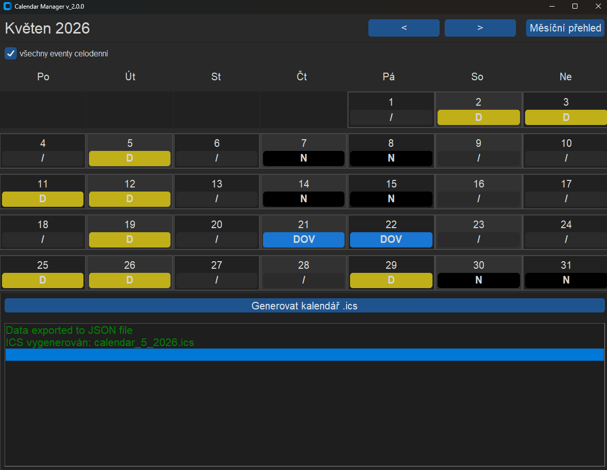
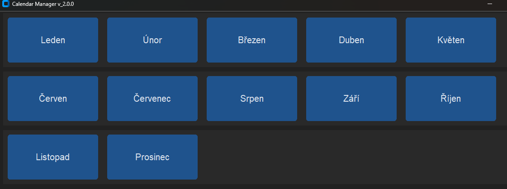

# Calendar Manager
calendar_manager je jednoduchá desktopová aplikace vyvíjená v Pythonu 3.12 (customtkinter).
- Lehký nástroj pro správu směn umožňuje zapisovat různé druhy služeb do .ics souboru (Google Calendar, Apple Calendar)

# Funkce
Evidence různých typů směn:
- Denní (7:00 – 19:00)
- Noční (19:00 – 7:00)
- Ranní (7:00 – 15:00)
- Dovolená / osobní volno
- Možnost označit všechny události jako celodenní
- Navigace mezi měsíci
- Automatické načítání uložených dat

# Adresářová struktura:
data/  
├── internal/     # aplikační data (JSON)  
└── calendars/    # exportované .ics soubory  

- Interní data jsou ukládána ve formátu JSON
- Export probíhá do souborů .ics pro snadný import do kalendářů
- Aplikace je distribuována jako samostatný spustitelný .exe soubor
    - vytvořeno pomocí nástroje PyInstaller.  

# Náhled aplikace:

